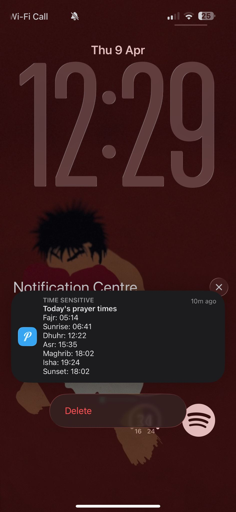
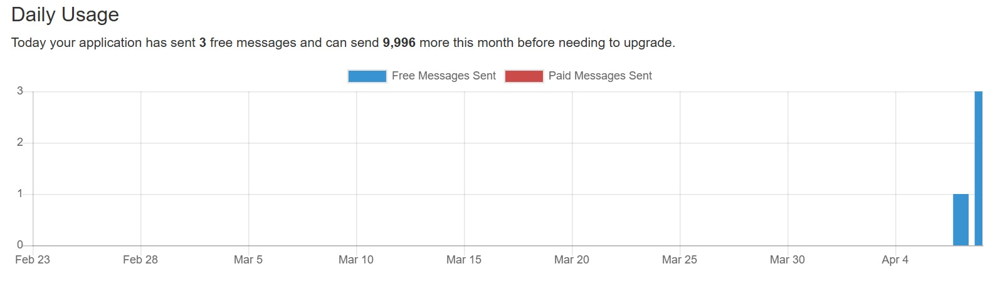
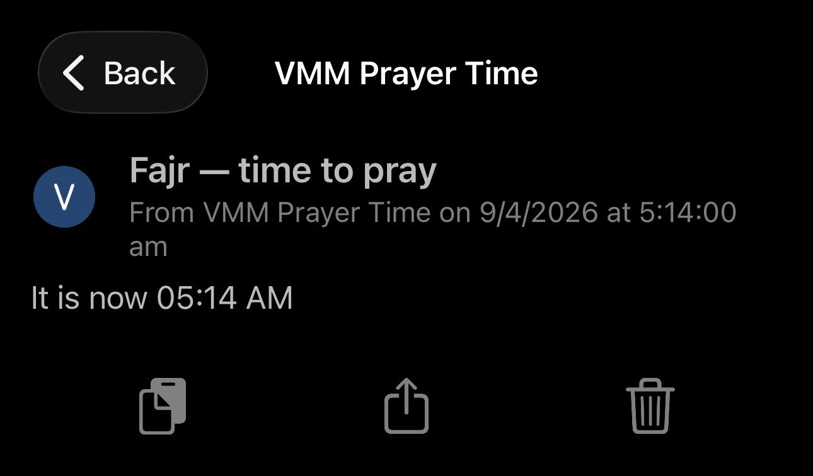
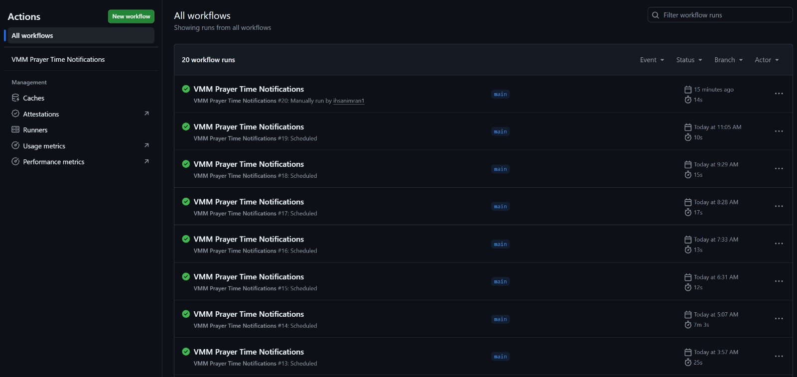

# 🕌 VMM Prayer Time Notifications

Sends you a push notification to your iPhone at each of the 5 daily Adhan times,
fetched from the same source as **awqat.com.au/vmm** (Virgin Mary Mosque, Hoppers Crossing).

Uses **GitHub Actions** (free) + **Pushover** ($5 one-time iPhone app).


---

## Setup (15–20 min, one time only)

### Step 1 — Install Pushover on your iPhone

1. Go to the App Store → search **Pushover** → buy it ($5 one-time, no subscription)
2. Open it and create a free account at https://pushover.net
3. After logging in, you'll see your **User Key** on the dashboard — copy it

### Step 2 — Create a Pushover Application

1. Go to https://pushover.net/apps/build
2. Fill in:
   - **Name**: `VMM Prayer Times` (or anything you like)
   - **Type**: Application
3. Click **Create Application**
4. Copy the **API Token** shown on the next page

### Step 3 — Create a GitHub Repository

1. Go to https://github.com → click **New repository**
2. Name it `vmm-prayer-notify` (or anything you like)
3. Make it **Private** ✅
4. Click **Create repository**

### Step 4 — Upload the files

Upload these 3 files to your new repo (drag & drop on GitHub works):

```
send_prayer_notifications.py
requirements.txt
.github/workflows/prayer-notify.yml
```

> **Note:** The `.github/workflows/` folder needs to be created as a path.
> On GitHub's web UI, when adding a new file, type `.github/workflows/prayer-notify.yml`
> as the filename and it will create the folders automatically.

### Step 5 — Add your Pushover secrets

1. In your repo, go to **Settings → Secrets and variables → Actions**
2. Click **New repository secret** and add:

| Name | Value |
|------|-------|
| `PUSHOVER_USER_KEY` | Your Pushover User Key (from Step 1) |
| `PUSHOVER_API_TOKEN` | Your app API Token (from Step 2) |



### Step 6 — Test it manually

1. Go to **Actions** tab in your repo
2. Click **VMM Prayer Time Notifications** in the left sidebar
3. Click **Run workflow** → **Run workflow**
4. Watch the logs — you should get a test notification on your iPhone within seconds ✅



---

## How it works

Every day at midnight Melbourne time, GitHub runs the script which:
1. Calls the **Aladhan API** (free, no key needed) for today's prayer times in Melbourne
   using the Muslim World League calculation method (same as VMM/awqat.com.au)
2. Waits until each prayer time arrives
3. Sends a push notification to your iPhone via Pushover

The GitHub Actions runner stays alive all day (up to 24h) to fire each notification on time.


---

## Daylight Saving Adjustment

Melbourne switches between AEDT (UTC+11, Oct–Apr) and AEST (UTC+10, Apr–Oct).

The workflow uses `pytz` to handle this automatically — the script always works in
Melbourne local time regardless of DST. The cron schedule in the workflow file
starts the runner at midnight Melbourne time; you may need to adjust the UTC offset
in the cron line twice a year:

```yaml
# AEDT (Oct–Apr): UTC+11 → midnight = 13:00 UTC
- cron: '0 13 * * *'

# AEST (Apr–Oct): UTC+10 → midnight = 14:00 UTC  
- cron: '0 14 * * *'
```

The script itself handles DST correctly — it's only the start time of the runner
that needs adjusting. As long as the runner starts before Fajr, all prayers will fire.

---

## Customisation

**Change notification priority** (to bypass iPhone's Do Not Disturb for Fajr):

In `send_prayer_notifications.py`, find the `priority` field and change it for Fajr:

```python
# High priority — bypasses DND, requires acknowledgement
"priority": 1

# Emergency priority — repeats until acknowledged (use carefully)
"priority": 2
```

**Change notification sound**: Set `"sound": "pushover"` or any sound listed at
https://pushover.net/api#sounds

---

## Files

```
vmm-prayer-notify/
├── send_prayer_notifications.py   # Main script
├── requirements.txt               # Python dependencies
└── .github/
    └── workflows/
        └── prayer-notify.yml      # GitHub Actions schedule
```
